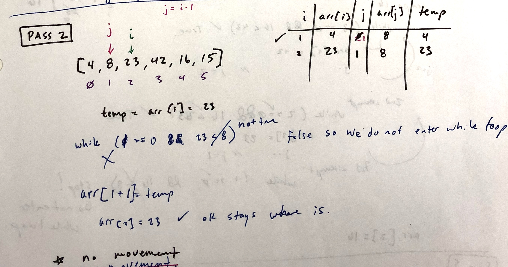
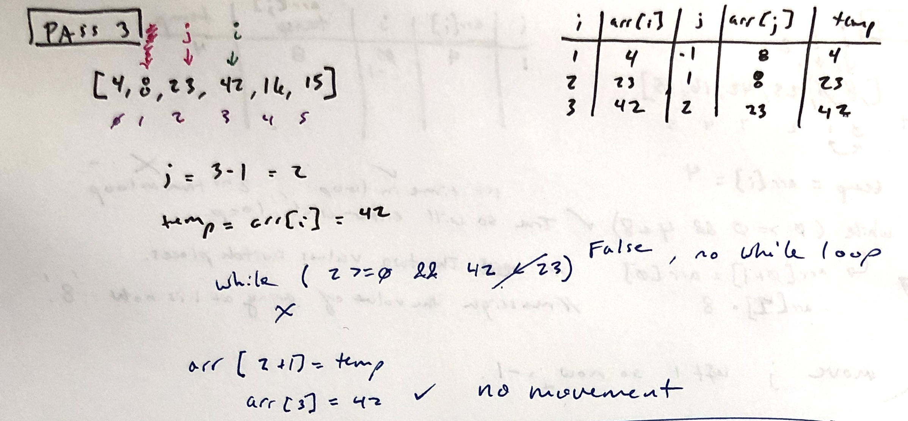
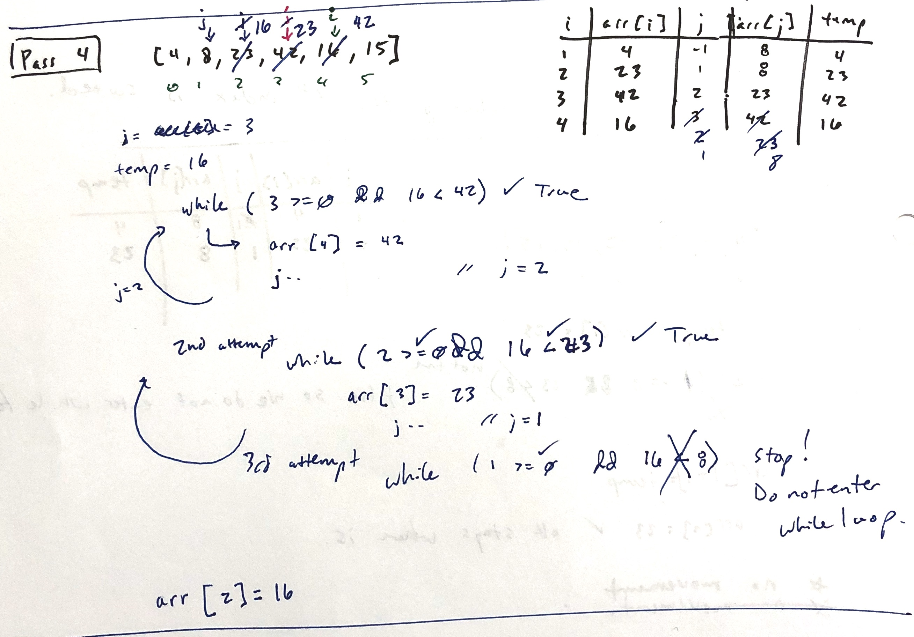
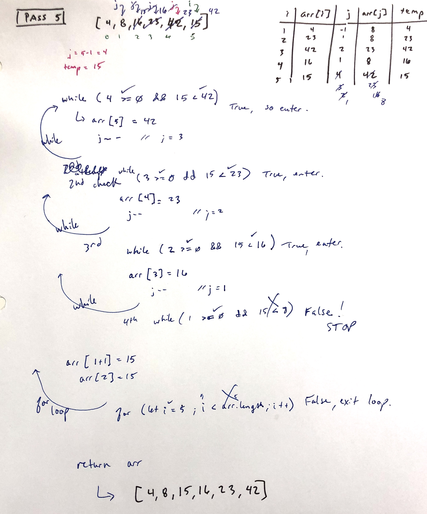
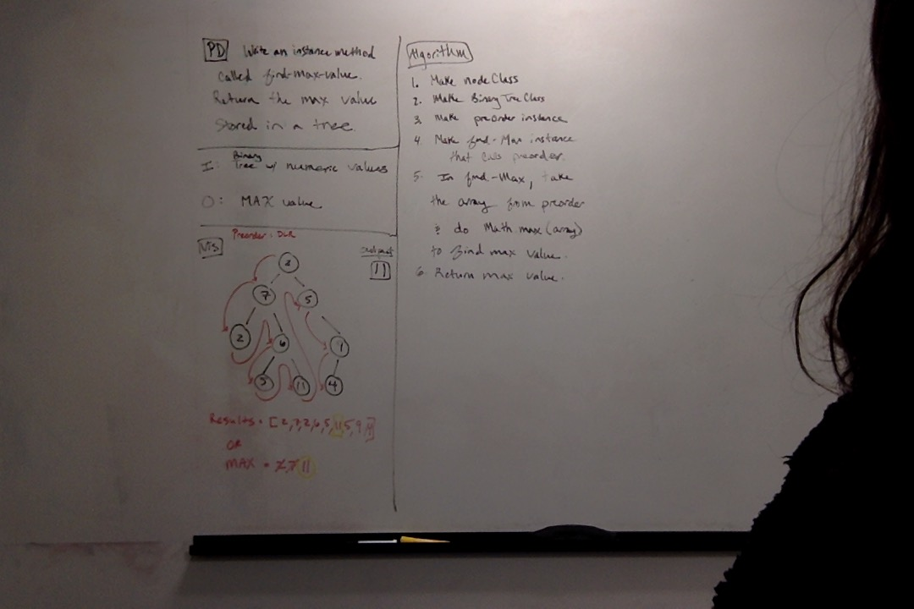
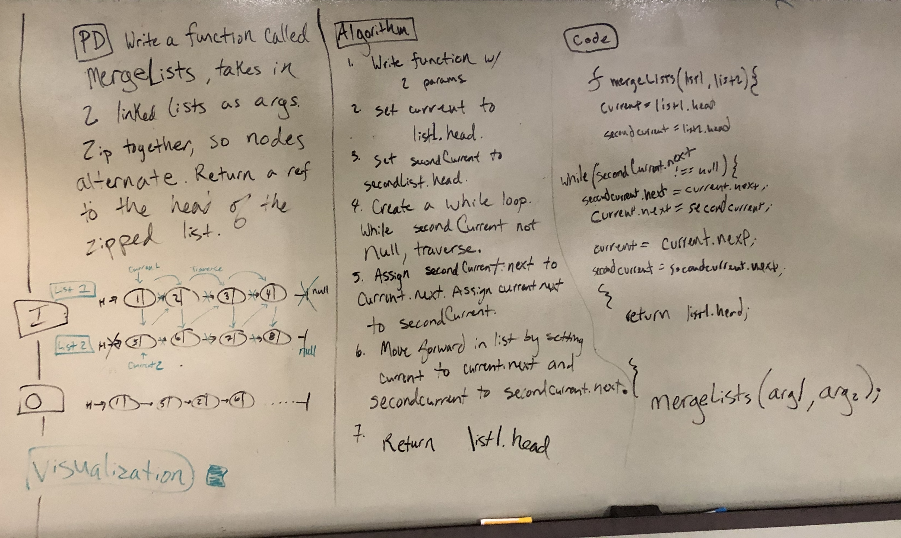
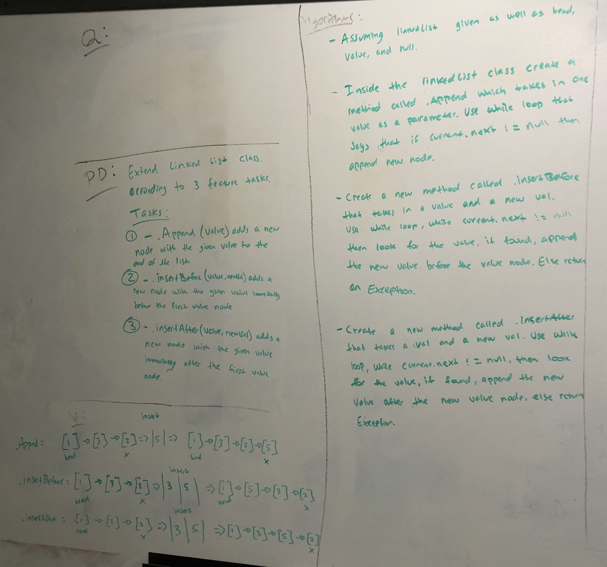

# 401 data-structures-and-algorithms

## Table of Contents
Data Structure | Challenge
-------------- | ---------------
Sort | Insertion Sort
Binary Trees | FindMaxValue
Stacks/Queue | Stacks and Queues Implementation
Stacks/Queue | FIFO Animal Shelter
Stacks/Queue | Implement a Queue using 2 stacks
LinkedList | Merge 2 lists
LinkedList | k-th value from the end
LinkedList | Linked list insertions
<!-- [GitHub](http://github.com) -->
  ***
# InsertionSort
Insertion Sort is a sorting algorithm where you traverse, element by element, and compare each element to the one that came before it. You look for the element before to be less than to current element (stored in a temporary variable).

## Challenge Description
I traversed my array using two indices: 'i' and 'j'. I used a variable called 'temp' to store the value of the current index. I used a for loop to traverse the length of the array and a while loop to check values of indecies.

## Approach & Efficiency
I used two loops so my Big(0) time is O(n^2). I did not create any new structures, so my Big(O) time is O(1).

## Solution

  ***

# Find the Maximum Value in a Binary Tree
[Binary Tree Notes](https://github.com/jmerlemeier-401-advanced-javascript/seattle-javascript-401d32/wiki/Trees)

## Challenge 18
Write an instance method called find-maximum-value. Without utilizing any of the built-in methods available to your language, return the maximum value stored in the tree. You can assume that the values stored in the Binary Tree will be numeric.

## Approach & Efficiency
I decided to traverse a binary tree using depth first traversal. I looked at each node, and stored the max value along the way. 
Time: 0(n)
Space: 0(n)

## Solution

***

# Stacks and Queues - Classes with Methods
[Stacks and Queue notes](https://github.com/jmerlemeier-401-advanced-javascript/seattle-javascript-401d32/wiki/Stacks-and-Queues)

## Challenge
From Code Fellows 401 Javascript Curriculum (2019)

### Features

1. Create a Node class that has properties for the value stored in the Node, and a pointer to the next node.

2. Create a Stack class that has a top property. It creates an empty Stack when instantiated.

  - This object should be aware of a default empty value assigned to top when the stack is created.
  - Define a method called *push* which takes any value as an argument and adds a new node with that value to the top of the stack with an O(1) Time performance.
  - Define a method called *pop* that does not take any argument, removes the node from the top of the stack, and returns the node’s value.
  - Define a method called *peek* that does not take an argument and returns the value of the node located on top of the stack, without removing it from the stack.
  - Define a method called *isEmpty* that does not take an argument, and returns a boolean indicating whether or not the stack is empty.

1. Create a Queue class that has a front property. It creates an empty Queue when instantiated.

  - This object should be aware of a default empty value assigned to front when the queue is created.
  - Define a method called *enqueue* which takes any value as an argument and adds a new node with that value to the back of the queue with an O(1) Time performance.
  - Define a method called *dequeue* that does not take any argument, removes the node from the front of the queue, and returns the node’s value.
  - Define a method called *peek* that does not take an argument and returns the value of the node located in the front of the queue, without removing it from the queue.
  - Define a method called *isEmpty* that does not take an argument, and returns a boolean indicating whether or not the queue is empty.

## Approach & Efficiency
I decided to use an array for the background of my stack and queue class. I did this because they are easy to visualize. I made sure to keep in mind that stacks are LIFO and queues are FIFO.

## API
Stack
- push()
- pop()
- peek()
- isEmpty()

Queue
- enqueue()
- dequeue()
- peek()
- isEmpty()

***

# First-in, First out Animal Shelter using 2 Queues
Create a class called AnimalShelter which holds only dogs and cats. The shelter operates using a first-in, first-out approach.

## Challenge
Implement the following methods:
enqueue(animal): adds animal to the shelter. animal can be either a dog or a cat object.
dequeue(pref): returns either a dog or a cat. If pref is not "dog" or "cat" then return null.

## Approach & Efficiency
I created 2 PseudoQueues using 2 stacks and stack methods. One queue was for cats and the other was for dogs.
Time: 0(1)
Space: 0(n)

## Solution

***

# Stacks and Queues

## Challenge
Create a new PseudoQueue class. Do not use an existing Quene. Instead, this PseudoQueue class will implement our standard queue interface, but will internally only utilize 2 stack objects. Ensure that you create your class with these methods:
  - enqueue(value): inserts value into the PseudoQueue.
  - dequeue(): which extracts a value from the PseudoQueue.
  
***

# Merge 2 Linked Lists 
Zip together 2 linked lists.

## Challenge
Use a function that takes in 2 list as arguments. Sip them together so that the node alternate. Then return the zipped list. Try to keep the space to O(1).
Access to: Node class and the linkedList class and methods.

## Approach & Efficiency
I created 2 temporary variables to help reference nodes a I re-assigned the order of the linked lists to they refererenced each other in the order I wanted.
Time: 0(n)
Space: 0(1)

## Solution

***

# 'k-th' value from end
Return the value of the node which is the 'k-th' from the end of the linked list.

## Challenge
Write a method on the Linked List class which takes a number, k, as a parameter. Retrun the node's value that is k from the end of the linked list.
Given: Node class and Linked List class with all properties and methods.

## Approach & Efficiency
I created 
Time: 0(n)
Space: 0(1)

## Solution

***

# Linked List Insertion Methods
Write 3 Insertion Methods on the Linked List class using the Node Class.

- .append();
- .insertBefore();
- .insertAfter();

## Challenge

Extend a linked List Class according to 3 features

1. linkedList.append(value) adds a new node with the given value to the end of the list.
2. linkedList.insertBefore(value, newVal) adds a new node with the new value immediately before the node with the given value.
3. linkedList.insertAfter(value, newVal) adds a new node with the new value immediately after the node with the given value.

## Approach & Efficiency
I used a while loop to traverse the linked list looking for either the end or the given value. When found, I inserted a new node. Depending on the function, I inserted the node at the end, before the value, or after it.
Time: 0(n)
Space: 0(n)

## Solution

***

Code Fellows - Seattle, WA - Advanced Javascript - 401d32 - 2019