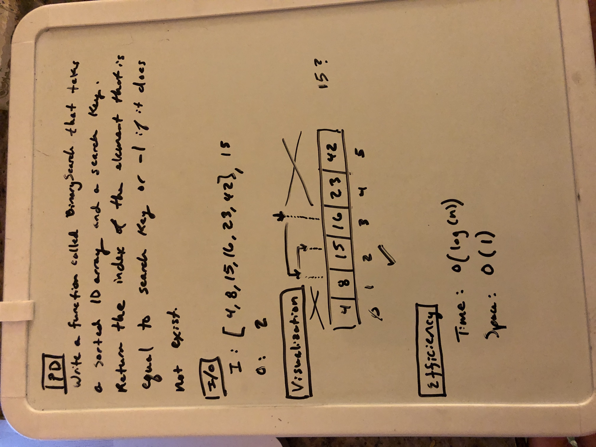
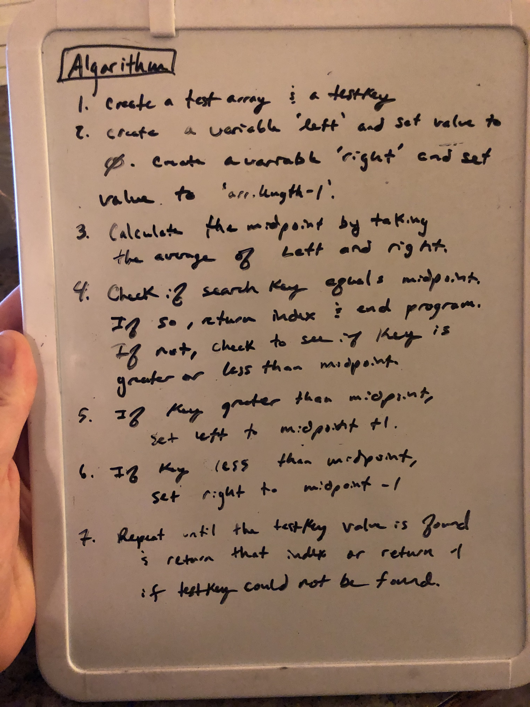
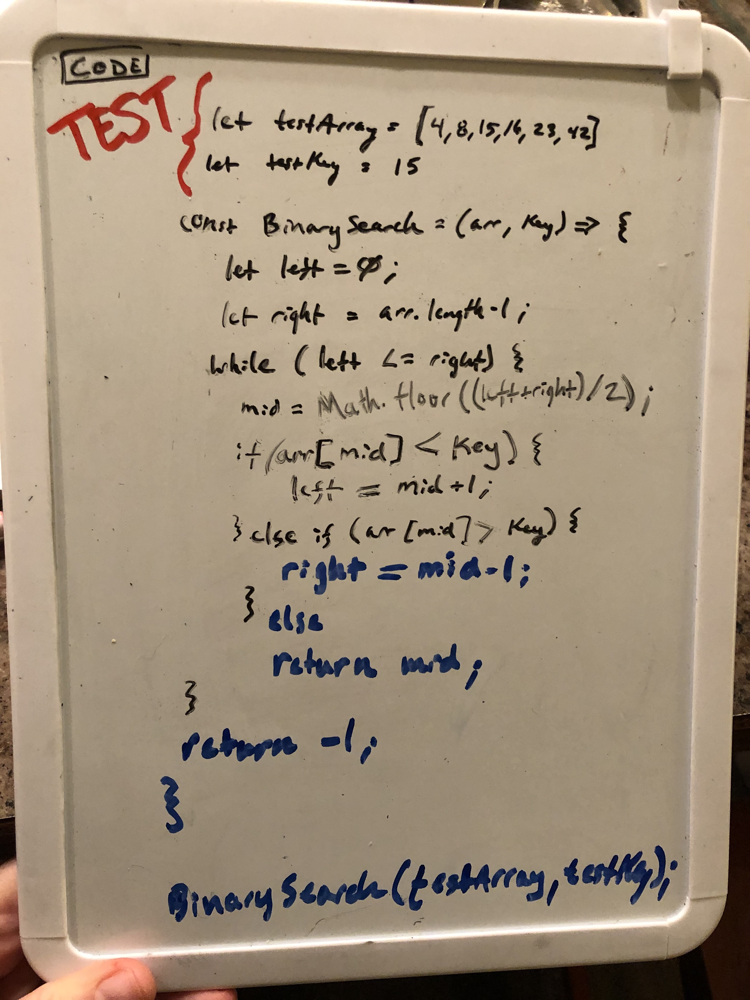
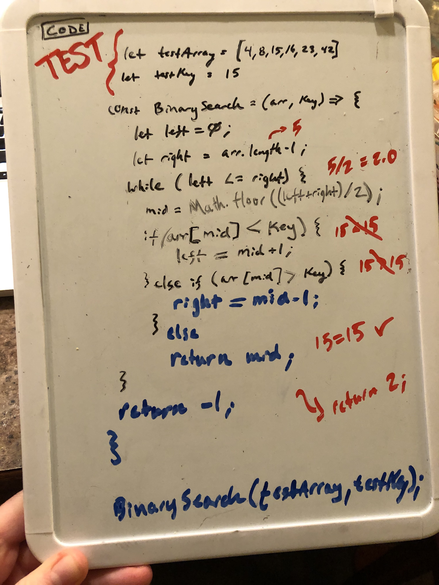

# Challenge Summary
Binary Search of 1d array is a search algorithm that finds the position of a target value within a sorted array (https://en.wikipedia.org/wiki/Binary_search_algorithm#Procedure).

## Challenge Description
This searches for the index of a key in a sorted list. It will return a -1 if the key is not found.

## Approach & Efficiency
Performance: O(log(n))
Storage: O(1)

## Solution

### Reference
Code located at: https://github.com/jmerlemeier/data-structures-and-algorithms/tree/master/code-challenges/arrayBinarySearch

### Task List
 - [ ] Top-level README “Table of Contents” is updated
 - [x] Feature tasks for this challenge are completed
 - [ ] Unit tests written and passing
     - [x] “Happy Path” - Expected outcome
     - [ ] Expected failure
     - [ ] Edge Case (if applicable/obvious)
 - [x] README for this challenge is complete
     - [x] Summary, Description, Approach & Efficiency, Solution
     - [x] Link to code
     - [x] Picture of whiteboard
