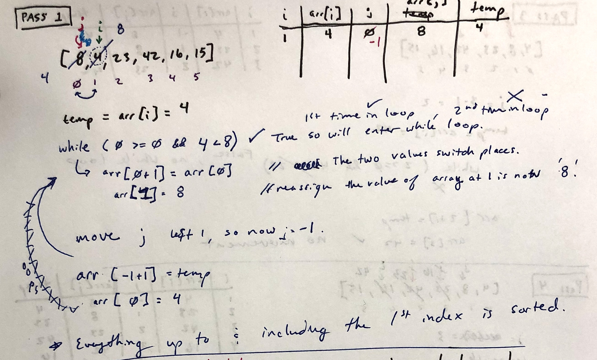
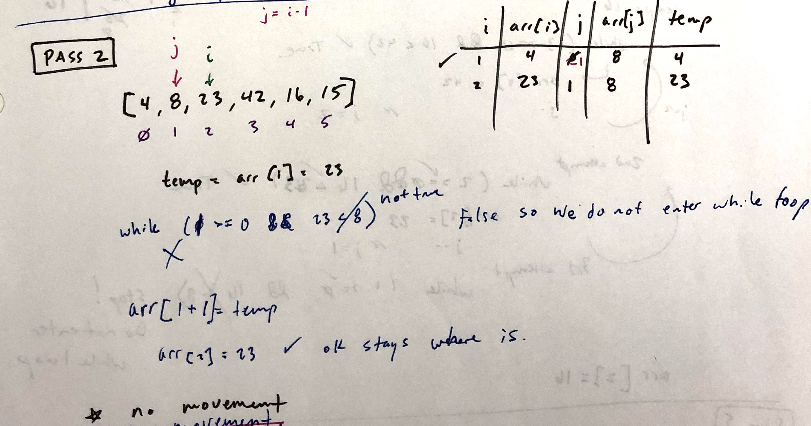

# Insertion Sort
Insertion Sort is a sorting algorithm where you traverse element by element and compare each element to the one that came before it. You look for the element before to be less than to current element (stored in a temporary variable).

## Pseudo Code

## Trace

Sample Array: `[8,4,23,42,16,15]`

#### Pass 1:

***
#### Pass 2:

***
#### Pass 3:

***
#### Pass 4:

***
#### Pass 5:

***
## Efficiency
* Time: O(n^2)
  * It is quadratic because we are sorting with 2 loops - an inner and outer. 
* Space: O(1)
  * Nothing is created, the array is sorted in place which keeps the space constant. 

  ***
  
  Resources:
  [Code Fellows Selection Sort](https://visualgo.net/en/sorting)   
  [Visualgo](https://visualgo.net/en/sorting)
